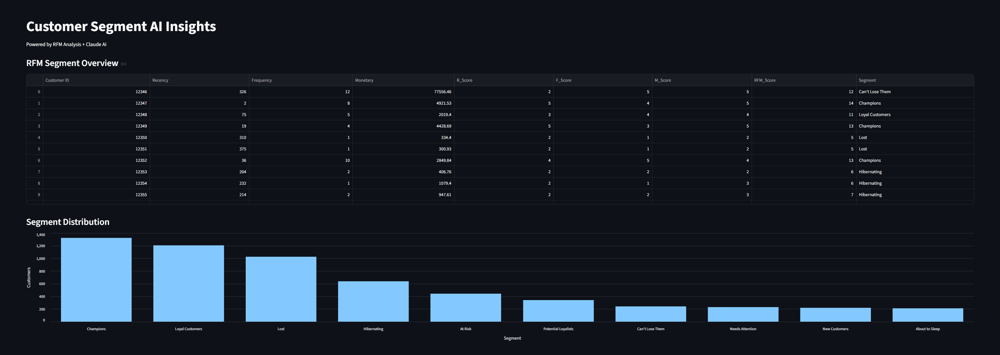

## AI-RFM-Dashboard

**[Live Demo](https://ore-rfm-dashboard.streamlit.app/)** | Python · Streamlit · Claude API



An AI-powered customer segmentation dashboard that combines RFM 
(Recency, Frequency, Monetary) analysis with Claude AI to generate 
automated business insights and marketing recommendations.

## Features
- RFM customer segmentation across 5,878 customers
- Interactive segment distribution charts
- AI-generated business insights powered by Claude API
- Actionable marketing recommendations per segment

## Tech Stack
Python, Pandas, Streamlit, Anthropic Claude API

## Setup
1. Clone the repo
2. Create a `.env` file with your Anthropic API key:
```
ANTHROPIC_API_KEY=your_key_here
```
3. Install dependencies:
```
pip install -r requirements.txt
```
4. Run the dashboard:
```
streamlit run ai_dashboard.py
```

## Dataset
UCI Online Retail II dataset: 500K+ transactions used for RFM analysis.
